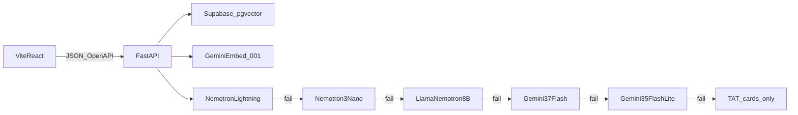
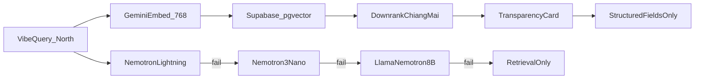

# สำเนาแผน VibeRoute

ไฟล์นี้คัดลอกมาไว้ในโปรเจกต์เพื่อส่งต่อทีม ต้นฉบับ Cursor ยังอยู่ที่เครื่องคนเขียนแผน

# VibeRoute: ทำเรื่องเดียวใน 24 ชั่วโมง

ถ้าต้องเลือกทำระบบตามโจทย์นี้ **หนึ่งเรื่อง** ให้ทำ **ตัวค้นหาด้วยความรู้สึก + การ์ดความจริงของข้อมูล TAT** ไม่แยกเป็นสองโปรเจกต์ และไม่ทำ itinerary / booking / chatbot ท่องเที่ยวทั่วไป

แกนเดโมมี 3 จังหวะ:

1. ผู้ใช้พิมพ์มู้ด เช่น "อยากไปที่เงียบๆ สโลว์ไลฟ์ หลีกหนีความวุ่นวาย"
2. ระบบดึงแหล่งที่ตรง vibe โดย **ดันชุมชน/จังหวัดรองขึ้นก่อน** จังหวัดคนล้น
3. แต่ละใบโชว์เฉพาะข้อเท็จจริงที่มีในฐาน และติดป้ายเมื่อฟิลด์ว่าง — AI ไม่เดา
4. แถบสถานะผู้ช่วยใช้ภาษาง่าย: พร้อม / สำรอง / ยังใช้ไม่ได้ โดยการ์ดที่เที่ยวยังขึ้นได้ทุกกรณี

**ขอบเขต:** สถาปัตยกรรมและตารางรองรับทั้ง 5 ภาค (8,634 แห่ง) **เดโม/POC รอบแข่ง ingest และค้นเฉพาะภาคเหนือ** (~2,077 แห่ง) ให้ทันเวลา ขยายภาคอื่นทีหลังด้วยค่า `region` โดยไม่รื้อ API

**เลิกใช้ Streamlit** แยก `frontend/` (Vite + React + TypeScript) กับ `backend/` (FastAPI) ประกอบกันที่ OpenAPI




## สถาปัตยกรรมแยก frontend / backend

โฟลเดอร์:

- `frontend/` Vite + React + TypeScript พอร์ต 5173 — แชท มู้ด แผนที่ การ์ด ประวัติ อัปโหลดรูป สถานะผู้ช่วย
- `backend/` FastAPI พอร์ต 8000 — ingest, embed, ค้น, สายโมเดล, ข้อเท็จจริงจากคอลัมน์, ฟีดแบ็ก, Storage
- `contracts/openapi.yaml` สัญญาเดียวที่ทั้งสองฝั่งล็อก ไม่ import ข้ามโฟลเดอร์

### รันและ deploy

**เครื่องท้องถิ่น / เดโมออฟไลน์แอป:** ทางเดียวคือ Docker `docker compose up --build` เปิด `http://localhost` nginx proxy `/v1` ไป backend ไม่ใช้ venv/`npm run dev` เป็นทางหลัก

**วันเดโม (ทางหลักตอนแข่ง):** backend รันใน Docker บน localhost แล้วเปิดชั่วคราวด้วย **Cloudflare Quick Tunnel** (`cloudflared tunnel --url http://localhost:<port>`) ได้ URL `https://*.trycloudflare.com`

- แนะนำเจาะพอร์ตหน้า nginx ของ Compose (ทั้ง UI+`/v1`) กรรมการเปิดลิงก์เดียว ไม่พึ่ง Vercel/Render ตอนขึ้นเวที
- ถ้าจะโชว์หน้าบน Vercel คู่กับ backend เครื่องตัวเอง: อย่าฝัง URL ตอน build (`VITE_API_BASE` เปลี่ยนทุกครั้งที่เปิดอุโมงค์) ให้ frontend อ่าน API base ตอนรัน (เช่น ค่าใน localStorage / ช่องตั้งค่าทีมงาน) แล้วชี้ไปที่ trycloudflare ของ backend
- CORS อนุญาตโดเมน Vercel และ `https://*.trycloudflare.com`
- อุโมงค์ต้องเปิดก่อนพรีเซนต์ URL ชั่วคราวหายเมื่อปิด `cloudflared` มีคลิปสำรองถ้าเน็ตงานแข่งไม่ให้ tunnel

**Frontend สาธารณะระยะยาว:** Vercel  
**Backend สาธารณะระยะยาว:** Render  
ทั้งคู่ไม่ใช้ตอนเดโมสด ถ้า Render หลับหรืออุโมงค์หลุด ยังเดโมบน `http://localhost` ได้

**Frontend สาธารณะ:** deploy โฟลเดอร์ `frontend/` ขึ้น **Vercel** เป็น Vite SPA

- Root Directory = `frontend`
- Build `vite build`, output `dist`
- `vercel.json` rewrite ทุกเส้นทางที่ไม่ใช่ไฟล์ไป `index.html`
**Backend สาธารณะ:** Web Service บน **Render** จาก `backend/Dockerfile`
- Bind `0.0.0.0:$PORT` (Render กำหนดพอร์ต ไม่ฮาร์ดโค้ด 8000)
- Health check `GET /v1/health`
- Env: `GEMINI_API_KEY`, `NVIDIA_API_KEY`, `SUPABASE_*`, `CORS_ORIGINS` รวมโดเมน Vercel
- ดิสก์บน Render หายเมื่อรีสตาร์ท/สปินดาวน์ จึงเก็บรูปและเวกเตอร์ที่ Supabase ไม่เก็บไฟล์ในคอนเทนเนอร์
- Vercel ตั้ง `VITE_API_BASE=https://<service>.onrender.com`
- แผนฟรีสปินดาวน์หลังไม่ยิง ~15 นาที ตื่นประมาณ 1 นาที **ไม่เหมาะตอนพรีเซนต์** ใช้ instance จ่ายถูก หรืออุ่น `/v1/health` ก่อนขึ้นเวที และมี Docker Compose เป็นแผนสำรองเน็ต/คูลสตาร์ท

Gemini / NVIDIA / Supabase ยังเป็นบริการภายนอกทั้ง Docker ท้องถิ่น, Vercel, และ Render

กุญแจโมเดลอยู่ที่ backend เท่านั้น บน Vercel มีแค่ URL ของ API

### สัญญา HTTP ที่แยกทำแล้วประกอบได้

Frontend mock ได้จาก schema นี้โดยไม่ต้องรอโมเดลจริง:

- `GET /v1/health` → `{ assistant: { level, label, detail }, embed_ready, listing_count }`
- `GET /v1/regions` และ `GET /v1/provinces?region=`
- `POST /v1/search` body `{ query, region?, province?, prefer_secondary, chat_id? }` — POC บังคับหรือค่าเริ่ม `region = ภาคเหนือ` ค่าเริ่ม `prefer_secondary = true`
  - response `{ chat_id, message_id, intro, assistant, prefer_secondary, secondary_count, places[], map_points[] }`
- `GET /v1/chats` และ `GET /v1/chats/{id}` ประวัติ
- `POST /v1/feedback` `{ message_id, att_id, rating: 1 | -1 }`
- `POST /v1/places/{att_id}/images` multipart จากผู้ใช้แชท
- `POST /v1/images/{image_id}/favorite` toggle ถูกใจ เพื่อเรียงรูปบนการ์ดคนอื่น

`places[]` แต่ละใบมี `att_id, name_th, province, district, type_label, why, score_vector, score_ranked, fee{status,label,text}, hours{status,label,text}, tel, website, facebook, limitation, lat, lng, images[]`

- `score_vector` = ความคล้ายมู้ดดิบจากเวกเตอร์ **ห้ามทับ**
- `score_ranked` = คะแนนหลังคูณสูตรเมืองรอง ถ้า `prefer_secondary = false` ให้เท่ากับ `score_vector`
- `lat`/`lng` เป็นตัวเลขหรือ `null` ห้ามส่งสตริง URL แผนที่
- `limitation` เป็นข้อความ `ATT_MARKET_LIMITATION` หรือ `null`

Backend เป็นคนใส่ `fee`/`hours`/`limitation` จากคอลัมน์ TAT ห้ามให้โมเดลเขียนฟิลด์นี้ Frontend ห้ามเดาราคาเอง

### สายโมเดลอธิบายมู้ด

สลับเฉพาะเมื่อ 429, 401/403, timeout, 5xx, เน็ตขาด ทุก hop ใช้ JSON schema เดียวกัน thinking ปิด max tokens สั้น

1. `nvidia/nemotron-3.5-lightning-30b-a3b`
2. `nvidia/nemotron-3-nano-30b-a3b`
3. `nvidia/llama-3.1-nemotron-nano-8b-v1`
4. `gemini-3.7-flash`
5. `gemini-3.5-flash-lite` (ชื่อจริงใน Gemini API ของ flash-lite ไม่ใช่ `gemini-flash-lite`)
6. ไม่เรียกโมเดล การ์ดยังขึ้น `why` จาก snippet

ฝังเวกเตอร์ยังเป็น `gemini-embedding-001` คนละงานกับ Flash

### UX ที่ frontend ต้องส่ง

ดูสัญญาจอเต็มด้านล่าง คน frontend ทำหน้าจาก OpenAPI คน backend ทำ response รูปเดียวกัน **ห้ามให้หน้าบ้านคำนวณค่าเข้าชม เวลา หรือพิกัดเอง**

## สัญญา Frontend — หน้าบ้านต้องแสดงอะไรบ้างให้ตรงกับระบบ

หน้าเดียวจบเดโม ไม่มีล็อกอิน ไม่มีแดชบอร์ด KPI ไม่มีหน้าแอดมิน ททท. โครงที่คนต่อทำมี 1 หน้า + แผงประวัติ

แหล่งความจริงของตัวเลข/ข้อความบนการ์ดคือ **response ของ backend** ไม่ใช่ `attraction.json` และไม่ใช่ข้อความที่โมเดลแต่ง

### โครงจอ (375px ขึ้นไป)

```
[ แถบสถานะผู้ช่วย ]     [ สวิตช์เน้นชุมชนและจังหวัดรอง ]
[ ประวัติแชทซ้าย ]      [ ข้อความ intro ]
                       [ แผนที่จาก map_points ]
                       [ การ์ด places[0..5] ]
[ ช่องพิมพ์มู้ด + ส่ง ]
```

จอแคบ: ประวัติเป็นแผงเลื่อนทับ แผนที่อยู่เหนือการ์ด

### สิ่งที่ต้องมีบนจอ กับฟิลด์ที่ใช้

1. **แถบสถานะผู้ช่วย (ตลอดเวลา)**  
   ยิง `GET /v1/health` ตอนเปิดแอป แล้วทับด้วย `assistant` จาก `POST /v1/search` ล่าสุด  
   แสดง `assistant.label` เป็นข้อความหลัก และ `assistant.detail` เป็นคำอธิบายสั้น  
   สีตาม `assistant.level` เท่านั้น: `ready` / `fallback` / `off`  
   ห้ามโชว์ชื่อโมเดล, HTTP code, คำว่า token — ชื่อเทคนิคอยู่ในแผง **สำหรับทีมงาน**

2. **สวิตช์เน้นชุมชนและจังหวัดรอง**  
   ค่าเริ่มต้นเปิด = ส่ง `prefer_secondary: true`  
   ปิด = ส่ง `prefer_secondary: false` แล้วค้นคำเดิมซ้ำ (หรือเรียงใหม่ถ้า backend ส่ง candidates มา)  
   ป้ายปิดสวิตช์ใช้ **เรียงตามความตรงมู้ด** หรือ **รวมเมืองหลัก** ห้ามเขียนว่า ยอดนิยม  
   หลังได้ผล โชว์ `secondary_count` เป็นข้อความเช่น “ใน 6 แห่งนี้ เป็นจังหวัดอื่นนอกเชียงใหม่ n แห่ง”

3. **ช่องค้นมู้ด**  
   ส่ง `POST /v1/search` `{ query, region: "ภาคเหนือ", province?, prefer_secondary, chat_id? }`  
   ภาคเริ่มต้นภาคเหนือ ตัวกรองจังหวัดอ่านจาก `GET /v1/provinces?region=ภาคเหนือ` ไม่ฮาร์ดโค้ดรายชื่อ  
   โหลด: ใช้ข้อความจากแผน “กำลังหาที่เที่ยวที่ตรงความรู้สึกของคุณ”  
   ผลว่าง: แสดง `intro` จาก backend ตามเดิม ห้ามเดาจังหวัดอื่นมาเติมการ์ด

4. **ข้อความ intro**  
   แสดง `intro` ทั้งก้อนใต้แชทผู้ใช้ ห้ามตัดแล้วแต่งใหม่

5. **การ์ดสถานที่ (สูงสุด 6 ใบ ตามลำดับ `places[]`)**  
   ห้ามเรียงใหม่เอง ห้ามซ่อนใบเพราะไม่มีรูปหรือไม่มีค่าเข้าชม

   | บนการ์ด | ฟิลด์ | กฎแสดง |
   |---|---|---|
   | ปก | `images` ใบที่ `is_cover` ถ้าไม่มีรูป ใช้พื้นว่าง ไม่ใช้ AI วาด | |
   | ชื่อ | `name_th` | ตาม backend |
   | ที่อยู่ | `province` · `district` | district ถ้า null ไม่โชว์ |
   | ประเภท | `type_label` | ถ้า null ไม่โชว์แท็ก |
   | ทำไมตรงมู้ด | `why` | ข้อความจาก backend ทั้งก้อน |
   | ค่าเข้าชม | `fee.label` + ป้าย `fee.status` | `confirmed` = มีในฐาน, `unknown` = ยังไม่มี ห้ามอ่าน `fee.text` ไปคำนวณราคาเอง |
   | เวลาเปิดปิด | `hours.label` + ป้าย `hours.status` | เหมือนค่าเข้าชม ห้าม parse เป็นชั่วโมง |
   | โทร | `tel` | โชว์ปุ่มโทรเฉพาะเมื่อ `tel` ไม่เป็น null เมื่อ `fee.status` หรือ `hours.status` เป็น unknown และมี tel ให้ใช้ประโยค “กรุณาติดต่อ [tel] ก่อนเดินทาง” |
   | ข้อจำกัด | `limitation` | โชว์กล่องเตือนเมื่อไม่เป็น null ไม่มีก็ไม่ต้องมีช่องว่างแดง |
   | เว็บ/เฟซ | `website` `facebook` | ลิงก์เมื่อมี |
   | คะแนน | `score_vector` `score_ranked` | แผงสำหรับทีมงานเท่านั้น หน้าหลักไม่โชว์ทศนิยม |
   | ตรง/ไม่ตรง | ปุ่มต่อใบ | `POST /v1/feedback` `{ message_id, att_id, rating: 1 \| -1 }` |
   | รูปจากนักท่องเที่ยว | อัปโหลด + ถูกใจ | ดูข้อ 7 |

6. **แผนที่**  
   ใช้ Leaflet + แผ่น OpenStreetMap ไม่ใช้ Google Maps ไม่ใช้คีย์  
   ปักเฉพาะจุดใน `map_points[]` (มี `lat` `lng` เป็นตัวเลขแล้ว)  
   ห้ามปักจาก `places[].lat` ถ้าเป็น null ห้ามแปลง URL เอง  
   จำนวนหมุดอาจน้อยกว่า 6 การ์ดที่ไม่มีหมุดยังอยู่

7. **รูป**  
   `POST /v1/places/{att_id}/images` multipart ชนิด jpg/png/webp ≤ 5MB  
   ปุ่มถูกใจ `POST /v1/images/{image_id}/favorite`  
   เรียงตามที่ backend ส่งมาแล้ว ห้ามเรียง `fav_count` เองถ้าไม่ตรงลำดับใน `images[]`  
   เฟส 1 โชว์ทันทีที่อัปโหลดสำเร็จ ไม่มีหน้าตรวจรูป

8. **ประวัติซ้าย**  
   `GET /v1/chats` รายการ, `GET /v1/chats/{id}` ทั้งข้อความ  
   คลิกประวัติแล้ววาด intro + การ์ด + แผนที่จาก payload ที่เก็บไว้ ไม่ค้นใหม่จนกว่าจะพิมพ์คำใหม่  
   ทุกคำขอใส่เฮดเดอร์ `X-Session-Id` (สร้าง UUID ในเบราว์เซอร์ครั้งแรก เก็บ localStorage)

9. **ที่อยู่ API ตอนรัน**  
   อ่านตอนรันจากช่องสำหรับทีมงาน / localStorage ไม่ฝัง `VITE_API_BASE` เป็นทางเดียว เพราะ URL trycloudflare เปลี่ยนทุกครั้ง ค่าเริ่ม `http://localhost:8000`

### สถานะที่ต้องมี (อย่าข้าม)

- เปิดแอปครั้งแรก ยังไม่ค้น: แถบสถานะจาก health + คำชวนพิมพ์มู้ด ไม่มีการ์ดปลอม
- กำลังค้น
- ได้ 6 การ์ด
- ได้ 0 การ์ด (ใช้ intro จาก backend)
- ผู้ช่วย `off` แต่การ์ดยังขึ้น
- อัปโหลดรูปไม่สำเร็จ (ชนิด/ขนาด)
- แผนที่ไม่มีหมุดเลย (ทุกใบ lat เป็น null) — ซ่อนแผนที่หรือโชว์ว่าง ไม่ใส่พิกัดเดา

### สิ่งที่หน้าบ้านห้ามทำ เพื่อไม่ให้เพี้ยนจากระบบ

- ห้ามคำนวณค่าเข้าชม เวลา พิกัด ข้อจำกัดตลาด จาก JSON ดิบ
- ห้ามเรียง `places[]` ใหม่ตามคะแนนที่หน้าบ้านคิดเอง
- ห้ามเขียนว่าฟรี/มีค่าเข้า ถ้า `fee.status !== "confirmed"`
- ห้ามเรียกโมเดลจากเบราว์เซอร์ ไม่มี API key บน frontend
- ห้ามมีหน้า login / สมัคร ในเฟส 1

### ลำดับงานคน frontend (โครงให้ต่อ)

1. หน้าเปล่า + client อ่าน OpenAPI + mock JSON ตาม schema
2. แถบสถานะ + ช่องค้น + เรนเดอร์การ์ดจาก mock ให้ครบฟิลด์ตารางด้านบน
3. ต่อ `POST /v1/search` จริง แผนที่จาก `map_points` สวิตช์ `prefer_secondary`
4. ประวัติ ฟีดแบ็ก อัปโหลดรูป ถูกใจ
5. โทนกระดาษ/หมึก รองรับ 375px แผงสำหรับทีมงาน

เดโมขั้นต่ำที่หน้าบ้านต้องโชว์ให้กรรมการเห็น: พิมพ์มู้ด → การ์ด 6 ใบพร้อมป้ายค่าเข้าชม/เวลา → สวิตช์เมืองรอง → แผนที่ → เคสไม่มีค่าเข้าชมแล้วยังมีเบอร์

แยกงานได้ทันทีเมื่อเริ่ม: คน frontend ทำหน้า + mock ตามสัญญานี้ คน backend ทำ ingest + router ให้ response รูปเดียวกัน

## Opportunity Canvas 11 ช่อง vs แผนที่ล็อกแล้ว

สถานะ = ในแผนทำ / ทำบางส่วน / ยังไม่ใส่ใน POC

1. **User** — ทำบางส่วน
  นักท่องเที่ยวสายประสบการณ์ครบใน UX ค้นมู้ด ททท./ชุมชนยังไม่มีพอร์ทัลแอดมิน โปรโมตเมืองรองผ่าน rerank + อัปโหลดรูปจากผู้ใช้
2. **Problem** — ในแผนทำ
  ค้นด้วยความรู้สึก, ดันชุมชน/จังหวัดรอง, ไม่ให้ AI มโนค่าเข้าชม/เวลา
3. **Current Process** — ในแผนทำ (เป็นเรื่องเล่าเดโม ไม่ใช่ฟีเจอร์)
  ใช้เป็นสไลด์ before: Google keyword → รีวิว → คนล้น/ข้อมูลผิด
4. **Pain Point** — ในแผนทำ
  ตอบด้วยผลค้นที่ตรงมู้ด, การ์ดชุมชน, ป้ายข้อมูลไม่ครบ + เบอร์โทร
5. **AI Capability** — ในแผนทำ (เข้มกว่าใน Canvas)
  Gemini embed เข้าใจมู้ด + retrieve top-k + LLM อธิบายจาก snippet เท่านั้น ข้อเท็จจริงอ่านคอลัมน์ ไม่พึ่ง prompt อย่างเดียว
6. **Required Data** — ทำบางส่วน
  ใช้ `ATT_DETAIL_TH` เป็นหลัก, `ATT_HILIGHT` เมื่อมี (มีแค่ ~5.7%) ตรวจ null ที่ `ATT_FEE_TH` / เวลาเปิดเป็นดาว  
   **ยังไม่ได้ใส่ `ATT_MARKET_LIMITATION` ในรายการฟิลด์เดโม** ทั้งที่ Canvas ระบุ — ฟิลด์นี้มีข้อมูล ~1.8% ถ้ามีให้โชว์เป็นป้ายข้อจำกัดเพิ่มได้ โดยไม่ให้ AI แต่ง  
   ไม่ยก `ATT_ACCESSIBILITY` เป็นช่องหลัก เพราะว่างเกือบหมด
7. **AI Output** — ในแผนทำ
  รายการที่ตรง vibe + แผนที่ + Data Transparency Card  
   ของเพิ่มจาก Canvas: ประวัติแชท, ปุ่มตรง/ไม่ตรง, รูปจากนักท่องเที่ยว+ถูกใจ
8. **Human Role** — ในแผนทำ
  คนเลือกสถานที่ คนโทรตามป้ายเตือน คนอัปโหลด/ถูกใจรูป คนกดว่าผลตรงหรือไม่
9. **Business Value** — ในแผนทำ (เป็นสไลด์)
  กระจายเมืองรอง, ททท. เป็นแหล่งที่ไว้ใจได้ ไม่มีแดชบอร์ดรายได้ชุมชนใน POC
10. **Risk & Mitigation** — ในแผนทำ (เข้มกว่าใน Canvas)
  Canvas กันหลอนด้วย system prompt — แผนบังคับ backend ใส่ `fee`/`hours` จากคอลัมน์, LLM ห้ามเขียนตัวเลข, โหมดไม่มีโมเดลการ์ดยังขึ้น
11. **KPI** — ยังไม่ใส่ในแอป
  Zero hallucination แสดงได้ด้วยเคสเดโม (ที่ไม่มีค่าเข้าชม แล้วไม่เดา) แต่ยังไม่มีตัวนับในระบบ  
   คลิกชุมชน/เมืองรอง: rerank มีแล้ว แต่ยังไม่นับคลิกเป็นตัวเลข KPI — รอบแข่งใช้สไลด์ + ปุ่มตรง/ไม่ตรงเป็นหลักฐานอ่อนๆ

ช่องที่ควรเติมในแผนให้ Canvas ครบโดยไม่พังสโคป: โชว์ `ATT_MARKET_LIMITATION` เมื่อมีค่า, นับจำนวนผลที่เป็นจังหวัดรองบนการ์ด/สไลด์เดโม ไม่สร้างแดชบอร์ดเต็ม

## ก่อนลงมือ: ล็อกกติกาที่ยังกำกวม (ไม่เพิ่มฟีเจอร์)

ผลิตภัณฑ์พร้อมแล้ว **อย่าเพิ่มพอร์ทัล ททท. / แดชบอร์ด KPI / itinerary / ฐานเวกเตอร์ในเครื่อง** สิ่งที่ยังต้องล็อกก่อนเขียนโค้ดมีแค่นี้:

### กติกา rerank ภาคเหนือ (วัดจากไฟล์จริง 2,077 แห่ง)

จังหวัดใน `REGION_NAME_TH = ภาคเหนือ` มี 17 จังหวัด เชียงใหม่หนาสุด 551 แห่ง

ดึงเวกเตอร์ top 12 แล้วเก็บ **สองคะแนนต่อแห่ง ห้ามทับของเดิม:**

- `score_vector` = cosine/similarity ดิบจาก pgvector ไม่คูณสูตร
- `score_ranked` = `score_vector` คูณตัวคูณด้านล่าง เมื่อ `prefer_secondary = true` ถ้าสวิตช์ปิด `score_ranked = score_vector`

ตัวคูณ (คูณซ้อนได้):

- จังหวัด `เชียงใหม่` × 0.72
- ประเภท `ห้างสรรพสินค้า/แหล่งช้อปปิ้ง/ตลาดสด/ตลาดนัด/ถนนคนเดิน` × 0.85
- ประเภทชุมชน / ชุมชนโบราณ / ศูนย์การเรียนรู้ / หมู่บ้าน / โครงการหลวง × 1.15
- จังหวัดอื่นในภาคเหนือนอกเชียงใหม่ × 1.08

เรียงตาม `score_ranked` แล้วตัดเหลือ 6 ส่งเข้า LLM และแผนที่

สวิตช์ UI **เน้นชุมชนและจังหวัดรอง** เปิดเป็นค่าเริ่มต้น ปิดแล้วใช้ลำดับ `score_vector` ดิบ — เชียงใหม่จะโผล่บ่อยขึ้นตามธรรมชาติของลิสต์ **ไม่สร้างคะแนนยอดนิยมจากจำนวนผู้เยี่ยมชม** เพราะไฟล์ TAT ไม่มีฟิลด์นั้น

เวกเตอร์ในฐานห้ามคูณสูตรใส่ embedding คูณเฉพาะตอนเรียงผล

### ข้อเท็จจริงบนการ์ด: id คู่เวกเตอร์ แล้วอ่านแถว ไม่ฝัง id ในข้อความ embed

**อย่าใส่ `ATT_ID` เข้าข้อความที่ส่งให้โมเดลฝังเวกเตอร์** รหัสยาวไม่มีนัยมู้ด จะทำให้ค้นมู้ดเพี้ยน

ตาราง listing หนึ่งแถวต่อแห่ง: คอลัมน์ `att_id` + ฟิลด์ TAT ที่ล้างแล้ว + คอลัมน์ `embedding` คนละช่อง ข้อความที่ฝังมีแค่ `ชื่อ | ประเภท | จังหวัด | รายละเอียด | highlight`

ตอนค้น:

1. ฝังข้อความมู้ด → pgvector คืน `att_id` + `score_vector` จำนวน 12
2. `SELECT` แถวจากตารางด้วย `att_id` เหล่านั้น เอาค่าเข้าชม เวลา โทร พิกัด ข้อจำกัดตลาด
3. **ห้ามอ่าน `attraction.json` ซ้ำทุกครั้งที่ค้น** JSON เป็นต้นทาง ingest ครั้งเดียว ตอนแสดงผลอ่านจากแถวใน Supabase

ค่าเข้าชม/เวลา/โทร:

- `ATT_FEE_TH` เป็นสตริงตัวเลข ค่า `0` = ฟรีตามฐาน TAT ว่าง = unknown ห้ามประมาณ `ATT_FEE_TH_KID` โชว์เมื่อมีค่าเท่านั้น
- เวลาเปิดปิดส่งข้อความ TAT ตามเดิม ห้าม parse เป็นชั่วโมง unknown เมื่อว่าง หรือข้อความ `วันและเวลาเปิด-ปิดทำการของสถานที่`
- อย่าขึ้นว่าให้โทร ถ้า `ATT_TEL` ว่างหรือ `-`
- โชว์ `ATT_MARKET_LIMITATION` เมื่อมี

### แผนที่บนหน้าผลค้น (Leaflet + OSM)

ไม่ใช้ Google Maps จึงไม่ต้องมีคีย์แผนที่ ไม่มีบิล

- **Leaflet** = ไลบรารีวาดแผนที่เลื่อน/ซูมในเบราว์เซอร์
- **OSM (OpenStreetMap)** = แผ่นพื้นถนน/แม่น้ำฟรีที่ Leaflet ปูให้

ปักหมุดเฉพาะเมื่อ `ATT_LOCATION` เป็นตัวเลขสองตัวคั่นด้วยจุลภาค เช่น `18.788, 98.985` แยกเป็น `lat`/`lng` เหนือมีพิกัดใช้ได้ 2,066 แห่ง

**ทิ้ง 11 จุดที่เป็นลิงก์** เช่น `https://maps.app.goo.gl/...` เพราะไม่ใช่พิกัด ปักแล้วแผนที่พัง การ์ดสถานที่นั้นยังโชว์ได้ แค่ไม่มีหมุด

`map_points[]` ส่งเฉพาะใบที่มี `lat`/`lng` ไม่ใช่ครบ 6 เสมอ

- **ID ซ้ำ/ชื่อ test:** ในภาคเหนือไม่มีแล้ว แต่ ingest ทั้งประเทศยังทิ้งชื่อ `test` พิกัดไม่ใช่ lat,lng และเก็บ `ATT_ID` ล่าสุดถ้าซ้ำ

### เดโมที่ต้องซ้อมด้วยสถานที่จริง

1. สโลว์ไลฟ์เงียบ → ต้องไม่โชว์เซ็นทรัลเชียงใหม่เป็นใบแรก (`20250606101017001` ค่าเข้าชมว่าง เวลาเป็น placeholder)
2. ชุมชนไม่ใช่วัดดังเชียงใหม่ → ตัวอย่างที่ควรโผล่ได้ เช่น สะพานบุญโขกู้โส่ แม่ฮ่องสอน (`20211115145426731761` ฟรีตามฐาน) หรือ เวียงภูเพียงแช่แห้ง น่าน
3. ไม่มีค่าเข้าชม + มีข้อจำกัดตลาด: เมืองเก่าอุทัยธานี (`20250620152816001` โทร `056 511 222`)
4. มีค่าเข้าชมยืนยัน: คุ้มเจ้าบุรีรัตน์ เชียงใหม่ (`20250606144646001` ค่า 60 บาท)

response ของ `/v1/search` ใส่ `secondary_count` (กี่ใบใน 6 ที่ไม่ใช่เชียงใหม่) ให้สไลด์ KPI อ้างได้ โดยไม่สร้างแดชบอร์ด

### โครงสร้างที่ต้องมีวันแรก ไม่ใช่ฟีเจอร์ใหม่

- คัดลอก `attraction.json` เข้า `data/` ในรีโป อย่า ingest จาก `Downloads` บนเครื่องเดียว
- ingest/embed เป็นสคริปต์ครั้งเดียว เก็บเวกเตอร์ใน Supabase **ห้ามฝังใหม่ทุกครั้งที่ `compose up`**
- `.env.example` มี `GEMINI_API_KEY` `NVIDIA_API_KEY` `SUPABASE_*` `CORS_ORIGINS`
- LLM ตอบ JSON schema เดียว `{ intro, places: [{ att_id, why }] }` ห้ามเขียน `fee`/`hours`
- ผลว่าง: ข้อความ “ไม่พบที่เที่ยวในภาคเหนือที่ตรงมู้ดนี้จากฐาน ททท.” ไม่เดาจังหวัดอื่น
- ถ้ายอมรับว่าเดโมพึ่งเน็ต 3 เส้น (Supabase + Gemini embed + NVIDIA) แผนสำรองคือคลิป **อย่าทำ pgvector ใน Docker เพิ่มใน 24 ชม.**

อย่าทำก่อนแข่ง: พอร์ทัลแอดมิน ททท., ล็อกอิน, ตรวจรูปเฟส 2, แดชบอร์ดรายได้ชุมชน, ฐานเวกเตอร์ท้องถิ่น

## แบ่งตามภาคก่อน (ยังไม่แยกเมืองหลัก/เมืองรอง)

นับจาก `REGION_NAME_TH` ทั้ง 8,634 รายการ:

- **ภาคกลาง 2,433** — มากสุด (28.2%)
- ภาคเหนือ 2,077 (24.1%)
- ภาคตะวันออกเฉียงเหนือ 1,485 (17.2%)
- ภาคใต้ 1,474 (17.1%)
- ภาคตะวันออก 1,153 (13.4%)
- ไม่มีชื่อภาค 12

อีสานกับใต้เกือบเท่ากัน

**ล็อกสโคปเดโม/POC: ภาคเหนือก่อน** (~2,077 แห่ง) ให้ทำครบค้นหา+การ์ด+รูป+สายโมเดลให้ทันแข่ง ผลิตภัณฑ์จริงตั้งใจครอบคลุมทุกภาค สัญญา API จึงมี `region` ตั้งแต่ต้น ในภาคเหนือเชียงใหม่มีลิสต์หนาที่สุด (551) จึง rerank ไม่ให้กลบเชียงราย แม่ฮ่องสอน น่าน ลำปาง ลำพูน แพร่ พะเยา สุโขทัย

## คนไปจริง vs จำนวนแหล่งใน JSON

ไฟล์ TAT นับ **แหล่งที่ถูกบันทึก** ไม่มีฟิลด์จำนวนผู้เยี่ยมชม คนนิยมจริงต้องเทียบกับสถิติกระทรวงการท่องเที่ยวและกีฬา / ททท.

คนไทยเที่ยวในประเทศปี 2567 (ล้านคน-ครั้ง):

- กรุงเทพฯ 30.80 — ในฐาน 626 แห่ง (อันดับ 1 ทั้งสองฝั่ง)
- ชลบุรี 15.51 — ในฐานแค่ 188 แห่ง (อันดับ 8 ของลิสต์)
- กาญจนบุรี 14.70 — ในฐาน 226 แห่ง (อันดับ 5)
- ประจวบคีรีขันธ์ 10.83 — ในฐาน 192 แห่ง (อันดับ 7)
- เพชรบุรี 10.72 — ในฐานแค่ 92 แห่ง (นอกท็อป 20 ของลิสต์)

ชาวต่างชาติกระจุกอีกแบบ: กรุงเทพฯ, ชลบุรี (พัทยา), ภูเก็ต, สุราษฎร์ธานี (สมุย), สงขลา, เชียงใหม่

ช่องว่างที่ใช้เล่า overtourism:

- **คนล้น แต่แหล่งในฐานไม่หนา:** ชลบุรี คนไปอันดับ 2 ของประเทศ แต่ลิสต์อันดับ 8; เพชรบุรี คนไทยไปอันดับ 5 แต่มีแค่ 92 แห่ง
- **ลิสต์หนา แต่ไม่ใช่จุดคนถล่ม:** เชียงใหม่มีแหล่งอันดับ 2 (551) แต่ปริมาณคนไทยทั้งปีไม่อยู่ท็อป 5 (อยู่ในท็อป 3 ของรายได้); เชียงราย 256 แห่ง / ชุมพร 199 แห่ง อยู่นอกท็อปผู้เยี่ยมชม
- **สรุป:** จังหวัดที่คนนิยมไปสุดคือ **กรุงเทพฯ แล้วชลบุรี** ไม่ใช่จังหวัดที่มีที่เที่ยวใน JSON มากเป็นอันดับ 2 (เชียงใหม่)

ใช้ตัวเลขนี้เป็นเหตุผล rerank ไม่ใช้จำนวนลิสต์เป็น proxy ความนิยม และอย่าอ้างว่าแหล่งในฐาน = ที่คนไปจริง




## ทำไมไม่เลือกอย่างอื่น

- ทำแค่ semantic search โดยไม่มีป้ายข้อมูลหาย = กรรมการไม่เห็นความต่างจาก ChatGPT
- ทำแค่ป้ายข้อมูลหายโดยไม่มี vibe = กลายเป็นตาราง TAT ไม่มี hook
- ทำทริปหลายวัน / กิจกรรม = `ATT_ACTIVITY` ว่าง 100% จะแต่งข้อมูลทันที
- ทำ accessibility เป็นจุดขายหลัก = ฟิลด์นี้มีข้อมูลแค่ 1.4% การ์ดทุกใบจะแดงเกือบหมด

---

## จุดขัดกับข้อมูลจริง (ต้องแก้ในดีไซน์)

- `ATT_HILIGHT` มีแค่ **5.7%** ใช้เป็นแหล่ง vibe หลักไม่ได้ ต้อง embed `ATT_NAME_TH` + `ATT_TYPE_LABEL` + `ATT_DETAIL_TH` และใส่ highlight เฉพาะเมื่อมี
- `ATT_DETAIL_EN` มีแค่ **3.2%** สินค้านี้เป็นไทยอย่างเดียว
- ชุดข้อมูลมีเมืองหลักเยอะ: กรุงเทพฯ 626, เชียงใหม่ 551, ภูเก็ต 187 ถ้าไม่ rerank จะได้วัด/ห้างในเมืองใหญ่ตลอด ขัด pain overtourism
- `ATT_FEE_TH` มีแค่ **34%** นี่คือฟิลด์โปร่งใสที่ควรโชว์เป็นดาวเด่น (ค่า 0 = ฟรี ถือว่ามีข้อมูล)
- `ATT_START_END` มี **93.5%** เวลาเปิดปิดส่วนใหญ่ยืนยันได้ ไม่ควรเตือนทุกใบ
- `ATT_ACCESSIBILITY` มีแค่ **117 แถว** อย่าทำให้เป็นช่องหลักบนการ์ด ให้เป็นแถวรองในส่วน "ยังไม่มีในฐาน"
- `ATT_TEL` มี **93%** ใช้เป็นทางออกเมื่อข้อมูลไม่ครบได้จริง
- พิกัดใช้ได้ 8,584/8,634; มีแถว `test` และชื่อซ้ำ ต้องทิ้งตอน ingest
- JSON ห่อด้วย SQL query เป็น key ไม่ใช่ array ตรงๆ

## Supabase + ขนาดข้อมูลภาคเหนือ: ขึ้นได้สบาย

กรอง `REGION_NAME_TH = ภาคเหนือ` ได้ **2,077 แห่ง** วัดจากไฟล์จริง:

- ข้อความที่เก็บ (ชื่อ รายละเอียดสะอาด จังหวัด ประเภท โทร พิกัด ค่าเข้าชม ฯลฯ) ประมาณ **8.1 MB**
- ความยาวข้อความสำหรับ embed เฉลี่ย 593 ตัวอักษร รวมทั้งชุด ~1.2 ล้านตัวอักษร มีแค่ 4 แถวที่ยาวเกิน ~4,000 ตัวอักษร ต้องตัดให้ไม่เกิน 2,048 token ของ `gemini-embedding-001`
- เวกเตอร์ดิบ float32:
  - 768 มิติ ~ **6.1 MB**
  - 1,536 มิติ ~ **12.2 MB**
  - 3,072 มิติ ~ **24.3 MB**
- รวม Postgres + ข้อความ + เวกเตอร์ + index HNSW โดยประมาณ:
  - 768d ~ **25–40 MB** ข้อมูลแอป (บวก overhead โปรเจกต์ว่างของ Supabase อีก ~40–60 MB)
  - 3,072d ~ **70–100 MB** ข้อมูลแอป
- โควตาฟรี 500 MB/โปรเจกต์ **เหลืออีกมาก** RAM 500 MB ก็เกินพอสำหรับ 2,077 แถว ไม่ชนเคส 15k เวกเตอร์ที่เคยเป็นปัญหาตอนคิดทั้งประเทศ

ขึ้น Supabase ได้แล้วถ้าสโคปแคบเหนือ ใช้ `vector(768)` เป็นค่าเริ่มต้น (Google แนะนำ 768 / 1536 / 3072 และ 768 ประหยัดที่สุดโดยคุณภาพยังดี)

ข้อจำกัดที่เหลือไม่ใช่ความจุ:

- โปรเจกต์ฟรีพักหลังไม่ใช้ 1 สัปดาห์
- เดโมพึ่งเน็ต 3 เส้น: Supabase + Gemini embed ตอนค้น + NVIDIA ตอนอธิบายมู้ด
- ถ้า Gemini embed ล่มตอนค้น ต้องมี fallback ค้นด้วยคำในจังหวัด/ชื่อ (`ilike`) การ์ดความจริงยังขึ้นจากแถวที่ดึงได้
- เก็บ embedding ที่คำนวณแล้วในตาราง ห้าม embed ซ้ำทั้ง 2,077 แถวทุกครั้งที่เปิดแอป

## Embeddings: Gemini ไม่ใช่โมเดลในเครื่อง

ล็อกเป็น `gemini-embedding-001` (ข้อความอย่างเดียว ฟรีใน Gemini API) อย่าใช้ `gemini-embedding-2` ถ้าไม่จำเป็น เพราะเป็นมัลติโมดอลและอาจไม่เข้าโควตาฟรีแบบเดียวกัน

- ingest: `task_type = RETRIEVAL_DOCUMENT`, `output_dimensionality = 768`
- query: โมเดลเดียวกัน `task_type = RETRIEVAL_QUERY`, มิติเดียวกัน
- ตัดข้อความต่อแห่งไม่เกิน ~2,000 token
- คีย์ `GEMINI_API_KEY` คนละตัวกับ `NVIDIA_API_KEY`
- ฟรีมีเรทลิมิต embedding (หลักแสน token ต่อนาที) ingest 2,077 แถวจบในไม่กี่นาทีถ้ายิงเป็นชุด

อย่าผูกข้อเท็จจริงกับ LLM ถ้าเน็ตหลุด การ์ดความจริงต้องอ่านจากแถวใน Supabase ได้โดยไม่เรียก NVIDIA

---

## สถาปัตยกรรมที่ตัดแล้วสำหรับ 24 ชม.

**อย่าให้ LLM เขียนค่าเข้าชมหรือเวลาเปิดปิด** แม้จะมี RAG ก็หลอนได้ แยกสองชั้น:

- Retrieval: semantic search ในภาคเหนือ + ลดน้ำหนักเชียงใหม่
- Facts: อ่านคอลัมน์ตรงๆ เท่านั้น `confirmed` หรือ `unknown`
- LLM: เขียนประโยค "ทำไมตรงมู้ดนี้" จาก snippet ที่ดึงมาเท่านั้น ห้ามเติมตัวเลข

Stack ที่ล็อก:

- Frontend: Vite + React + TypeScript
- Backend: FastAPI
- สัญญา: `contracts/openapi.yaml`
- Embeddings: Gemini `gemini-embedding-001` ที่ 768 มิติ เก็บใน Supabase `pgvector`
- LLM อธิบายมู้ด: NVIDIA แล้วตามด้วย Gemini 3.7 Flash และ 3.5 Flash-Lite
- โหมดไม่มีโมเดลต้องยังโชว์การ์ดจากฐานได้

### สายโมเดลอธิบายมู้ด (หลัก → สำรอง)

1. `nvidia/nemotron-3.5-lightning-30b-a3b`
2. `nvidia/nemotron-3-nano-30b-a3b`
3. `nvidia/llama-3.1-nemotron-nano-8b-v1`
4. `gemini-3.7-flash`
5. `gemini-3.5-flash-lite`
6. ไม่เรียกโมเดล การ์ดความจริงยังทำงาน

กติกาเรียก:

- สลับตัวเมื่อได้ HTTP 429, 401/403, timeout, 5xx หรือเน็ตขาด ไม่สลับเพราะคำตอบไม่สวย
- ปิด thinking และจำกัด max tokens สั้นๆ
- ไม่โชว์ชื่อโมเดลเทคนิคกับผู้ใช้ทั่วไป เก็บไว้ใน สำหรับทีมงาน

### ข้อความ UI สำหรับคนทั่วไป

แถบสถานะบนหน้าเสมอ สีเดียว ไม่มีรหัส HTTP:

- **ผู้ช่วยพร้อม** — ใช้ Lightning ได้
- **กำลังใช้ผู้ช่วยสำรอง** — ตัวหลักไม่ว่างหรือโควตาเต็ม สลับให้อัตโนมัติ
- **ผู้ช่วยยังไม่พร้อม** — ค้นหาที่เที่ยวจากข้อมูล ททท. ได้ตามปกติ

ข้อความตามเหตุการณ์ (ภาษาพูด ไม่พูดว่า token / 429 / API):

- โหลด: "กำลังหาที่เที่ยวที่ตรงความรู้สึกของคุณ"
- สลับสำรอง: "ผู้ช่วยหลักไม่ว่างในตอนนี้ ระบบใช้ผู้ช่วยสำรองให้อัตโนมัติ ข้อมูลที่เที่ยวยังมาจากฐาน ททท. เหมือนเดิม"
- โควตา/คนใช้เยอะ: "ตอนนี้มีผู้ใช้ผู้ช่วยหนาแน่น ระบบสลับโหมดให้อัตโนมัติ"
- เน็ตหลุด/ต่อโมเดลไม่ได้: "เชื่อมต่อผู้ช่วยไม่สำเร็จในรอบนี้ ด้านล่างคือที่เที่ยวจากข้อมูล ททท. ที่ยืนยันได้"
- โมเดลทุกตัวล่ม: "ผู้ช่วยอธิบายมู้ดไม่ได้ชั่วคราว แต่รายการที่เที่ยว ค่าเข้าชม และเวลาเปิดปิดด้านล่างยังเป็นข้อมูลจริงจากฐาน ไม่ได้เดา"
- ไม่มีคีย์: "ผู้ช่วยยังไม่ได้เปิดใช้ ค้นหาจากฐานข้อมูลได้ตามปกติ"

ห้ามโชว์ stack trace, ชื่อโมเดลยาว, หรือคำว่า token บน UI หลัก

### กฎการ์ดความจริง (Data Transparency Card)

แสดงเฉพาะฟิลด์เหล่านี้ และติดสถานะ:

- ยืนยันได้บ่อย: ชื่อ, จังหวัด, ประเภท, พิกัด, `ATT_START_END`, `ATT_TEL`
- บ่อยครั้งว่าง: `ATT_FEE_TH` / `ATT_FEE_TH_KID` — ถ้า null ขึ้นว่า "ระบบยังไม่มีข้อมูลยืนยัน กรุณาติดต่อ [เบอร์] ก่อนเดินทาง" **ห้ามใส่ราคาประมาณ**
- รอง: เว็บ, Facebook, accessibility — โชว์เมื่อมี ไม่โชว์เป็นช่องแดงหลัก
- ถ้า `ATT_FEE_TH == 0` แสดงว่า **ฟรี (ตามฐาน TAT)** ไม่ใช่ unknown

### กติกาเมืองรองในภาคเหนือ

หลังได้ top 12 จากเวกเตอร์ เก็บ `score_vector` ไว้ แล้วค่อยคูณเป็น `score_ranked` ตามสูตรด้านบน สวิตช์ **เน้นชุมชนและจังหวัดรอง** เปิดเป็นค่าเริ่มต้น ปิดแล้วเรียงตามคะแนนดิบ ไม่ใส่ตัวเลขผู้เยี่ยมชมปลอมในแอป

### Data prep ที่ต้องทำจริง

จาก [c:\Users\surap\Downloads\attraction.json](c:\Users\surap\Downloads\attraction.json):

- อ่าน JSON จาก key SQL ไม่ใช่ array ชั้นนอก
- กรอง `REGION_NAME_TH == ภาคเหนือ` **เฉพาะงาน ingest ของ POC** ตารางเก็บฟิลด์ `region` ไว้แล้ว รอบหลัง ingest ภาคอื่นเพิ่มได้โดยไม่เปลี่ยน schema
- BeautifulSoup ล้าง HTML ใน `ATT_DETAIL_TH`
- ทิ้งชื่อ `test`, พิกัดที่ไม่ใช่ `lat,lng`, แถวที่รายละเอียดว่าง
- เก็บแค่ฟิลด์เดโม: id, ชื่อ, จังหวัด, อำเภอ, ภาค, ประเภท, รายละเอียดสะอาด, highlight, พิกัดแยก lat/lng, โทร, เวลาเปิดปิด, ค่าเข้าชม, ค่าเข้าชมเด็ก, ข้อจำกัดตลาด, accessibility, เว็บ
- ข้อความที่ใช้ embed: `ชื่อ | ประเภท | จังหวัด | รายละเอียด | highlight` **ไม่มี att_id ในสตริงนี้** `att_id` อยู่คอลัมน์คู่เวกเตอร์
- ไม่ส่งรายละเอียดยาวทั้งก้อนเข้า LLM ส่งแค่ top 6 การ์ด + snippet สั้น
- คีย์ NVIDIA และ Gemini เก็บใน `.env` ห้าม commit

## ตัวกรองก่อน เพื่อไม่ให้ AI อ่านทั้งไฟล์

ไฟล์ต้นทางมีประมาณ 5.2 แสนบรรทัด แต่เป็น **8,634 รายการ** ไม่ใช่ 500,000 แถว หลังกรองภาคเหนือเหลือประมาณ **2,077 แห่ง**

AI ไม่ได้อ่านชุดนี้ทั้งก้อน แยก 3 ชั้น:

1. **กรองตอนเตรียมข้อมูล (ครั้งเดียว):** เหลือแค่ภาคเหนือ ล้าง HTML ทิ้งแถว `test`/พิกัดพัง
2. **ฝังรายการล่วงหน้า (listing embeddings):** Gemini ทำครั้งเดียว เก็บใน Supabase ไม่คิด token ใหม่ทุกครั้งที่ผู้ใช้ค้น
3. **ตอนพิมพ์มู้ด:** ฝังข้อความที่พิมพ์ 1 ครั้ง → ค้นเวกเตอร์เอา top 12 → rerank เหลือ 6 → ส่งเข้า NVIDIA แค่ 6 การ์ด สั้นๆ (ชื่อ จังหวัด ประเภท snippet ค่าเข้าชม/เวลาว่ามีหรือไม่มี) ไม่ส่งรายละเอียดเต็ม

ผลคือ token ของ LLM ต่อรอบค้นอยู่ที่หลักพัน ไม่ใช่หลักแสน

## ควรทำ embed listing ไหม

**ควรทำ** เพราะผู้ใช้พิมพ์ความรู้สึก ไม่ได้พิมพ์ชื่อสถานที่

- Listing embed = ความหมายของแต่ละที่ จากชื่อ + ประเภท + จังหวัด + รายละเอียด
- Query embed = ข้อความมู้ดที่พิมพ์ เช่น "เงียบ สโลว์ไลฟ์"
- โมเดลเดียวกัน `gemini-embedding-001` คนละ `task_type` (`RETRIEVAL_DOCUMENT` / `RETRIEVAL_QUERY`)

ถ้าไม่ฝังรายการล่วงหน้า ทุกครั้งต้องให้ LLM กวาดทั้งฐาน ซึ่งแพง ช้า และหลอนง่าย

ไม่ทำ embed แบบฟังเสียง (listening) ในรอบนี้ เดโมเป็นการพิมพ์

## ประวัติแชท + ให้คะแนนความตรง

เก็บเป็นเซสชันใน Supabase:

- คำที่พิมพ์, 6 แห่งที่ดึงได้, คำอธิบายมู้ด, สถานะผู้ช่วย
- ปุ่มต่อแห่ง: **ตรง** / **ไม่ตรง**
- ใช้คะแนนนี้ไปช่วยจัดอันดับรอบหน้าเมื่อมู้ดคล้ายกัน ไม่ได้เอาไปเทรนโมเดลใหม่ใน 24 ชม.
- กรรมการเห็นได้ว่ามี loop ตรวจสอบความแม่นยำ ไม่ได้เชื่อ AI ล้วน

## เพิ่มรูปสถานที่ (ผู้ใช้แชทอัปโหลดได้)

ชุด TAT ไม่มี URL รูป **ผู้ที่กำลังคุยในแชทอัปโหลดลงการ์ดสถานที่นั้นได้เลย** ไม่จำกัดแค่แอดมิน ถ้ายังไม่มีรูป การ์ดข้อมูลอย่างเดียวก็ใช้ได้ ห้ามให้ AI วาดหรือเดารูป ห้ามส่งรูปเข้าโมเดลอธิบายมู้ดในเฟส 1

ตาราง `place_images` เตรียมฟิลด์ให้ครบทั้งสองเฟสตั้งแต่ต้น: `id, att_id, storage_path, uploader_session, fav_count, moderation_status, created_at`

### เฟส 1 (ทำในเดโม): รับทันที + รูปยอดนิยมขึ้นก่อน

- อัปโหลดแล้ว `moderation_status = accepted` โชว์ทันที
- จำกัดชนิด `.jpg .png .webp` และขนาดไฟล์ (เช่น ไม่เกิน 5 MB)
- ปุ่ม **ถูกใจรูปนี้** ต่อรูป คนอื่นมาค้นเจอสถานที่เดียวกันจะเห็นรูปที่ถูกใจมากสุดเป็นปกการ์ด แล้วเรียงแกลเลอรี `fav_count DESC, created_at DESC`
- จำว่าเซสชันนี้ถูกใจรูปไหนแล้ว เพื่อกดซ้ำแล้วถอนได้
- `POST /v1/places/{att_id}/images` และ `POST /v1/images/{image_id}/favorite` (toggle)
- `places[].images[]` ใน search response ส่งมาเรียงแล้ว พร้อม `is_cover`, `fav_count`, `viewer_faved`

ไม่ทำระบบสมาชิกเต็มในเฟส 1 ใช้ `session_id` จากเบราว์เซอร์พอสำหรับเดโม

### เฟส 2 (ยังไม่ทำตอนนี้ แต่สัญญาไม่พัง): กันรูปมั่วและอนาจาร

- ค่าเริ่มอัปโหลดเป็น `pending` การ์ดโชว์เฉพาะ `accepted`
- ตรวจด้วยโมเดลภาพ (เช่น Gemini) แยกอนาจาร / ไม่ใช่สถานที่ / ผ่าน แล้วค่อย `accepted` หรือ `rejected`
- UX คนอัปโหลดเห็นว่า “ได้รับรูปแล้ว กำลังตรวจ” ไม่โชว์ให้คนอื่นจนกว่าจะผ่าน
- เฟส 1 ใส่สถานะ `accepted` ไปเลย เพื่อไม่ต้องย้ายตารางตอนเปิดเฟส 2

---

---

## สิ่งที่ขาดในแผนเดิม (ต้องเติม)

- ไม่มีกติกา **เมืองรอง** ทั้งที่ pain 2 เป็นแกนโจทย์
- พึ่ง `ATT_HILIGHT` มากเกินไปทั้งที่เกือบว่าง
- ยก `ATT_ACCESSIBILITY` เป็นตัวอย่าง anti-hallucination ทั้งที่ว่างเกือบหมด ควรใช้ **ค่าเข้าชม** เป็นตัวอย่างหลัก
- RAG อย่างเดียวไม่กันหลอน ต้อง **schema แยกข้อเท็จจริง** ไม่ให้โมเดลเติม null
- แผนใช้ Supabase/LLM ทั้งเส้น ขัดกับแผนสำรองเน็ตหลุด ต้องมีโหมดไม่มีผู้ช่วย
- ยังไม่มีขั้นตอนทิ้งข้อมูลขยะ (`test`, พิกัดพัง, id ซ้ำ)
- แยก frontend/backend ที่ OpenAPI ไม่ผูก UI กับคีย์โมเดล

## สิ่งที่ไม่ทำในรอบนี้

- Itinerary หลายวัน, จอง, ชำระเงิน
- Embed ภาษาอังกฤษเป็นหลัก
- Fine-tune โมเดล
- ทำครบ 59 ฟิลด์บน UI
- นับ visiter จริง / โมเดล overtourism เชิงตัวเลข

---

## สปริ้น 24 ชม. ที่ตัดแล้ว

- **คืนนี้:** ล็อก OpenAPI, backend ingest+embed+search, frontend mock การ์ด/แชท
- **เช้า:** สาย NVIDIA + Gemini 3.7 Flash + Flash-Lite, รูป, ฟีดแบ็ก, ทดสอบ 429
- **ก่อนพรีเซนต์:** ประกอบ FE+BE, อัดคลิป, สไลด์ 5–6 หน้า

พรอมต์เดโมที่ควรซ้อม:

1. สโลว์ไลฟ์ เงียบ หลีกหนีความวุ่นวาย ในภาคเหนือ
2. พาเด็กเที่ยวชุมชน ไม่ใช่วัดดังในเชียงใหม่
3. ถามราคาที่ที่ `ATT_FEE_TH` เป็น null เพื่อโชว์ป้ายเตือน + เบอร์โทร
4. ปิดเน็ตหรือถอดคีย์ เพื่อโชว์ว่าการ์ดความจริงยังอยู่ และข้อความ "ผู้ช่วยยังไม่พร้อม" อ่านรู้เรื่อง

